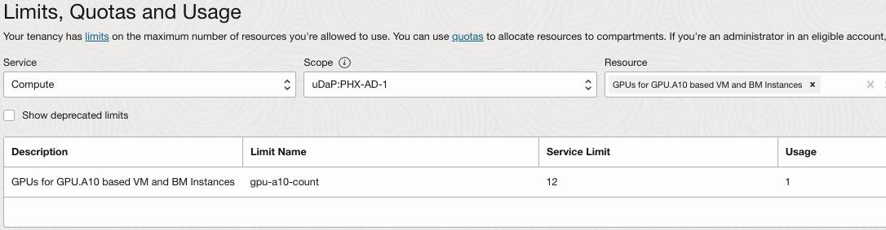
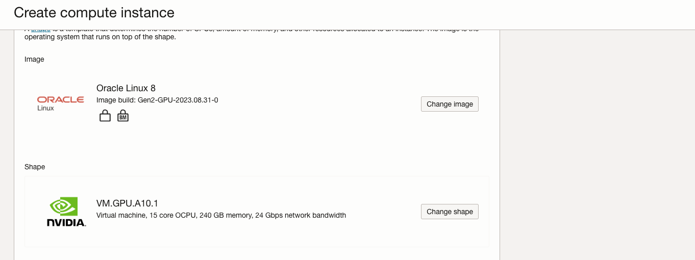
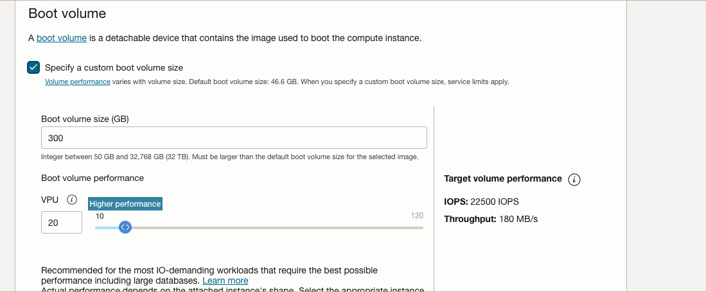
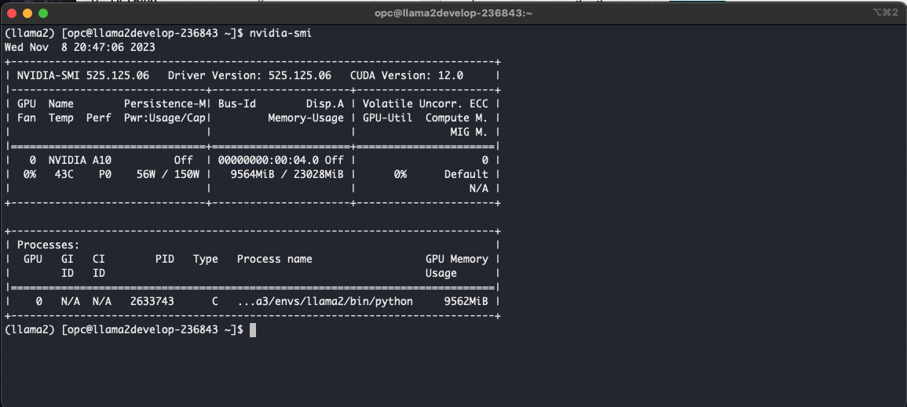
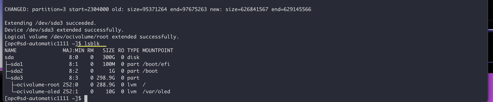
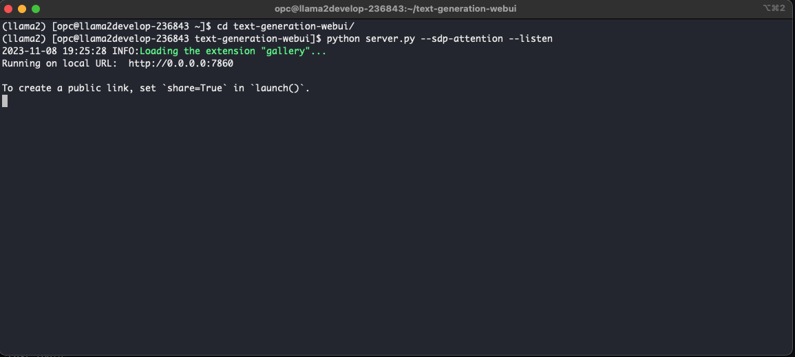
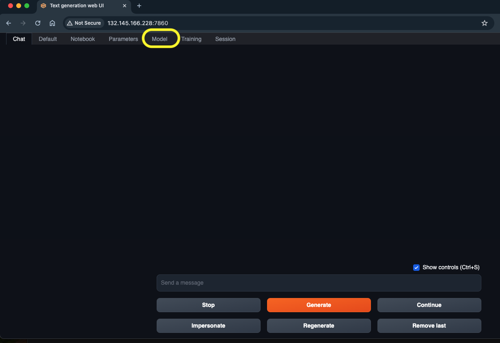
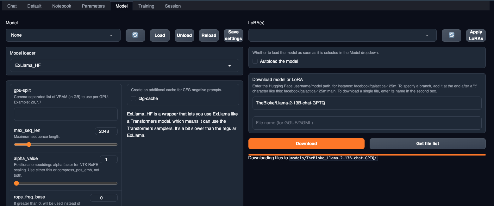
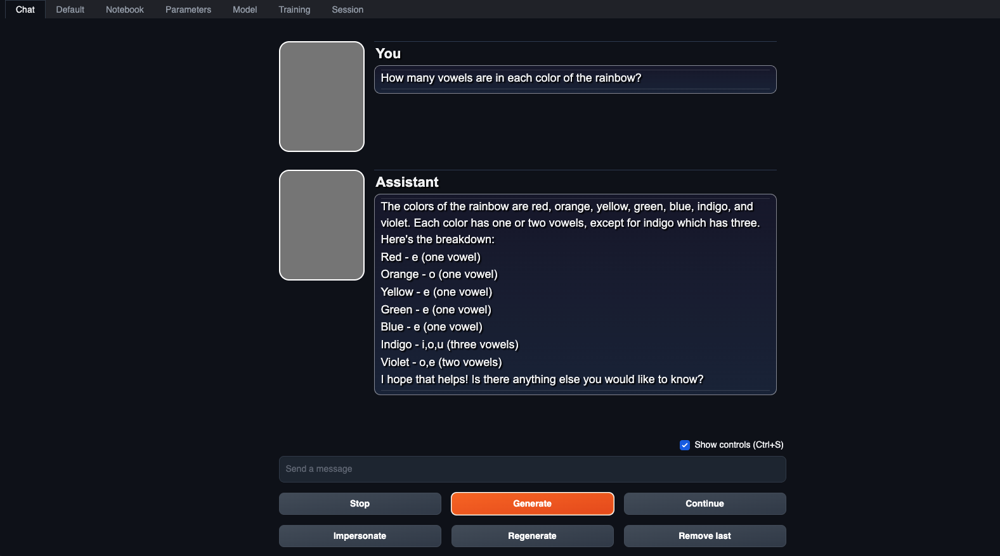

# llama2-on-oci
Llama2 using Text generation WebUI running in OCI GPUs with OL8.

---
duration: PT0H45M0S
description: Learn how to deploy Llama2 with Text Generation Gradio WebUI on Oracle Cloud Infrastructure (OCI) GPUs with Oracle Linux 8
level: Advanced
roles: GenAI;Devops;Developer;
products: en/cloud/oracle-cloud-infrastructure/oci;GPUs;GenAI;
keywords: Llama2 13B text generation
inject-note: true
---

## Introduction

LLAMA2 is a state-of-the-art deep learning architecture designed to scale machine learning models efficiently on resource-constrained devices. The platform is incredibly scalable and adaptable, allowing organizations to process enormous amounts of data with ease, extract meaningful insights, and react rapidly to shifting market conditions. One of the key features of Llama2 is its ability to process data in near real-time, which enables businesses to respond promptly to changes in their environment. Additionally, it supports a variety of data sources and processing frameworks, including Apache Kafka, Apache Flink, Apache Spark, and more. This means that developers can choose the best tools for their specific needs.

Llama2 also offers a number of other useful features, such as support for streaming SQL, integration with popular big data tools like Hadoop and YARN, and strong security measures to ensure data privacy and integrity. Overall, Llama2 is a powerful tool that can help organizations efficiently process and analyze large datasets, giving them a competitive edge in today's fast-paced digital landscape.

The architecture consists of several components working together to generate human-like responses.
At the core of the model is the transformer encoder, which takes in a sequence of words or text and outputs a series of vectors representing the input. These vectors are then passed through a feedforward neural network (FFNN) and a layer of residual connections to generate the final output.

The FFNN is composed of fully connected layers that process the input sequences and produce contextualized embeddings. The residual connections allow the model to learn more complex patterns in the data and improve its overall performance.

In addition to these core components, Llama LLM also includes several other modules to help fine-tune the model and improve its accuracy. These include a tokenizer to convert text inputs into numerical tokens, a vocabulary to store learned subwords, and a mask to prevent exposure bias during training.

### Objective

[Text Generation WebUI](https://github.com/oobabooga/text-generation-webui) is an gradio Web UI for Large Language Models. It supports API and Command-line tools as well if they are your thing. This WebUI supports multiple model backends which include transformers, llama.cpp, ExLlama, ExLlamaV2, AutoGPTQ, GPTQ-for-Llama,CTransformers and AutoAWQ. Also supports LoRA models, finetuning, training a new LoRA using QLoRA. It has Extensions Framework to load your favorite Extensions for your models. It has OpenAI-compatible API Server. In this tutorial we will install everything needed to run the WebUI and load Llama2 models to run text generation. 

### Prerequisities
1. Oracle Cloud Infrastructure (OCI) tenancy with A10 GPU limits. 
2. An existing OCI Virtual Cloud Network (VCN) with atleast one public subnet and limits for public IP.
3. An Llama 2 Model checkpoint from your favorite Huggingface Creator. Please make sure your model supports the backends mentioned above. 


## Task 1: Provision an GPU compute instance on OCI 

- Launch a compute instance on OCI with existing VCN with public subnet. For more information, see:

   - [Launch Compute Instance](https://docs.oracle.com/en/learn/oci-basics-tutorial/index.html#launch-compute-instance)

- Choose one from these available GPU.A10 shapes.

    ```
    VM.GPU.A10.1
    VM.GPU.A10.2
    BM.GPU.A10.4

    ```
- When launching a compute instance change shape to one of the above shapes. 

- If your tenancy does not have a service limit set for GPU.A10, these shapes will not be in the shape list.

  - To check your tenancy limits in the OCI Console, set the region where you are going to provision a GPU.A10 compute instance, open the navigation menu and click **Governance & Administration**.

  - Under **Tenancy Management**, select **Limits, Quotas and Usage**.

  - Set the service to Compute, select one of availability domains in the scope field, and type *GPU.A10* in the resource field.

  - Select **GPUs for A10 based VM and BM instances**

    

- Compute limits are per availability domain. Check if the limit is set in any of availability domains of the region. If the service limit is set to 0 for all availability domains, you can click on the "request a service limit increase" link and submit a limit increase request for this resource.

    > **Note**: In order to access Limits, Quotas and Usage you must be a member of the tenancy Administrators group or your group must have a policy assigned to read LimitsAndUsageViewers.

    - For more information about service limits, see [Service Limits](https://docs.oracle.com/en-us/iaas/Content/General/Concepts/servicelimits.htm#ViewingYourServiceLimitsQuotasandUsage).

- Currently OCI GPU.A10 compute shapes support Oracle Linux, Ubuntu and Rocky Linux. Windows is supported by VM shapes only.

     >**Note**: Rocky Linux is not officially supported by NVIDIA.

- When provisioning a compute instance on OCI, use a standard OS image or GPU enabled Image. If you go with standard OS image, please know that requires NVIDIA vGPU driver to be installed.

  

- Expand Boot Volume section to increase the boot volume to atleast 250GB and increase VPU to Higher Performance to get a decent read/write for better inferencing. 
  
  

- Launch the instance with above parameters.  


## Task 2: Install Pre-requisites for Llama2

- As NVIDIA drivers are included in the Oracle Linux GPU build image, we can simply verify their presence and functionality by running the nvidia-smi command. This will ensure that everything is properly set up and the GPU drivers are functioning as expected.
  

- **Grow FileSystem** OCI instances system memory comes with 46.6GB default. Since we increased our Boot Volume to 300GB, let us grow our File System with in built OCI command from OCI Util.

To expand the file system on your OCI instance after increasing the boot volume to 300GB, you can use the built-in OCI (Oracle Cloud Infrastructure) command. Here's how you can do it:

   - **Check the current disk usage**: Before resizing the file system, it's a good practice to check the current disk usage to ensure it reflects the increased boot volume size. You can use the `df` command for this purpose:
   
   ```bash
   df -h
   ```

   Verify that the available space matches your new boot volume size (300GB).

   - **Resize the File System**: Use the OCI utility command to resize the file system to make use of the increased storage. The exact command can vary depending on the specific OS and file system you're using. The below is used for Oracle Linux 8
  
     ```
      sudo /usr/libexec/oci-growfs
     ```
    Enter 'y' when asked to confirm that you are extending partition.

   - **Verify the File System Expansion**: After running the resize command, check the disk usage again to confirm that the file system has been successfully expanded:

   ```bash
   df -h
   ```

   It should now reflect the increased file system size.

By following these steps, you should be able to expand your file system on your OCI instance to utilize the additional storage space provided by the increased boot volume. 

  


- **Install Python 3.10.9 in Oracle Linux 8**
    ```
    sudo dnf update -y
    sudo dnf install curl gcc openssl-devel bzip2-devel libffi-devel zlib-devel wget make -y
    wget https://www.python.org/ftp/python/3.10.6/Python-3.10.9.tar.xz
    tar -xf Python-3.10.9.tar.xz
    cd Python-3.10.9/
    ./configure --enable-optimizations
    make -j 2
    nproc
    sudo make altinstall
    python3.10 -V

    ```
- Now that we have Python3.10.9 installed let us install git to clone Git repos:

    ```
    sudo dnf install git
    ```

- **Clone text-generation-webui**
  ```
  git clone https://github.com/oobabooga/text-generation-webui
  ```
  You should have the repo text-generation-webui in your cloned directory

- **Install Conda**
  ```
  mkdir -p ~/miniconda3
  wget https://repo.anaconda.com/miniconda/Miniconda3-latest-Linux-x86_64.sh -O ~/miniconda3/miniconda.sh
  bash ~/miniconda3/miniconda.sh -b -u -p ~/miniconda3
  rm -rf ~/miniconda3/miniconda.sh
  ~/miniconda3/bin/conda init bash

  ```
  
  Now create Conda environment

  ```
  conda create -n llama2 python=3.10.9 # llama2 being the conda environment name
  conda activate llama2
  ```

- **Install PyTorch 2.0**
  ```
  pip3 install torch torchvision torchaudio --index-url https://download.pytorch.org/whl/cu118
  ```

- **Install requirements.txt**
  ```
  pip3 install -r requirements.txt
  ```

- **Update Firewall rules to allow port 7860 traffic**
  ```
  sudo firewall-cmd --list-all # To check existing added ports
  sudo firewall-cmd --zone=public --permanent --add-port 7860/tcp
  sudo firewall-cmd --reload
  sudo firewall-cmd --list-all # Confirm that port has been added.
  ```

## Task 3: Run Llama2

- With Pre-requisites successfully installed, we're ready to move forward with running text-generation-webui. Navigate to the text-generation-webui directory and run the below.

  ```
  python server.py --sdp-attention --listen
  ```

  The outcome of this process should load the essential modules and launch the inference server on port 7860.
  

- After confirming a successful deployment with the server running on port 7860 as demonstrated above, let's proceed to access the text-generation-webui application. Open your web browser and enter the following address: http://<PublicIP>:7860, replacing "<PublicIP>" with the instance's public IP address.

Once you do this, the application should load and appear as illustrated below. Navigate to the section Model on the top as highlighted.

 

In the Model section , enter huggingface repo for your desired Llama 2 model. For our purposes, we selected GPTQ model from the huggingface repo "TheBloke/Llama-2-13B-chat-GPTQ". 

Download the model and load it in the Model section. 

  

Once you load it, navigate to the Chat section to start text generation with Llama 2. 

  


## Task 4: Deploy text generation webui via service manager systemctl

Create a file `llama2.service` in the path `/etc/systemd/system` 
And enter the below in the file `llama2.service`
```
[Unit]
Description=systemd service start llama2

[Service]
WorkingDirectory=/home/opc/text-generation-webui
ExecStart=bash /home/opc/text-generation-webui/start.sh
User=opc
[Install]
WantedBy=multi-user.target
```

Make sure to change your working directory to the necessary. Here we mentioned start.sh as exectution file, lets create that file in the text-generation-webui directory.
And enter the below in the file 
```
#!/bin/sh
# - the script is ran via anaconda python
# - output is not buffered (-u)
# - stdout & stderr are stored to a log file
# - we're executing the working directory specified in the systemd service file
/home/opc/miniconda3/envs/llama2/bin/python server.py --sdp-attention --listen
```
This makes sure to always use your conda environment "llama2". Activating conda environment from systemd service is not desirable. Hence we use shell script to start and then use shell script to run the app.


Run the below commands to reload and enable/start the service.

```
sudo systemctl daemon-reload
sudo systemctl enable llama2.service
sudo systemctl start llama2.service
```
Run the below command to check the status of the service.

```
sudo systemctl start llama2.service
```


## Related Links

- [text-generation-webui Github Repo Link](https://github.com/oobabooga/text-generation-webui)
- [Miniconda3](https://repo.anaconda.com/miniconda/Miniconda3-latest-Linux-x86_64.sh)
- [Llama2 13B Chat GPTQ Model ](https://huggingface.co/TheBloke/Llama-2-13B-chat-GPTQ)
- [Python 3.10.9](https://www.python.org/ftp/python/3.10.9/Python-3.10.9.tar.xz)


## Acknowledgments

**Authors** - Abhiram Ampabathina (Senior Cloud Architect)
